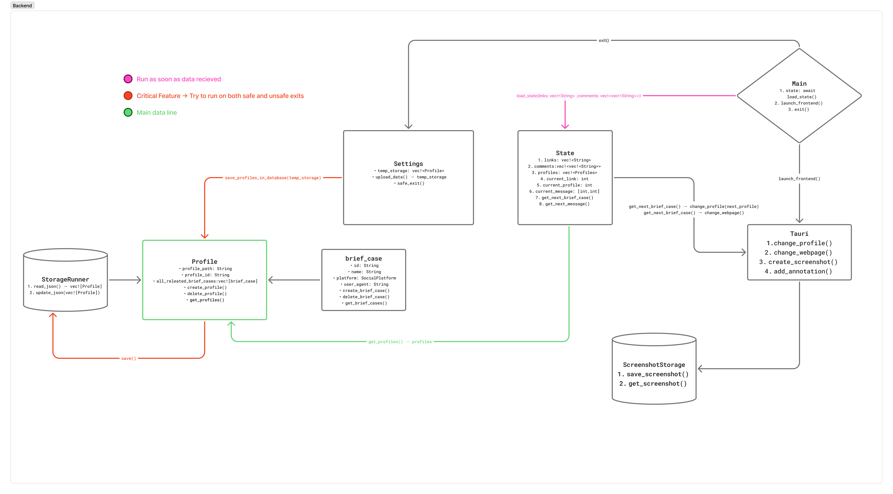

# Attachè - A Social Media Multi-Profile Manager

This app will be able to traverse through different profiles and users which are henceforth called brief_cases to load social media posts, to be able to post comments.
It will create a small helper tab on the side, and in the center create a webview,
and change this webview on click of a button to a different webview based on the links
of the posts.

User will be able to quickly change profiles in a single application, with a single button / keyboard click. It will also take screenshot of the page, and then take user to a screen where they can put a tick mark on the comment they just did.

After the process is completed either due to running through all profiles or user simply quiting, user will be presented with a screenshot viewer where they will be able to inspect all the screenshot and then with a click send the screenshot using native share APIs.

This app will use Tauri for backend and React for the frontend.

## Rational on using these technologies

### Rust is being used because

Rust and tauri are very fast, and lightweight and most importantly cross-platform compatible. Tauri using native webview of the operating system to render webpages make the final binary size smaller, and perfectly fit this use case as we do not need all the bells and whistles that come with a chromieum embedded application.

### React is used because

1. I know it
2. I will be able to use external libraries to make the app more interactive
   A. Chakra UI (To make UI Development fast, the scope of this project is not to create frontend from scratch, hence I used a UI component library)
   B. Zustand - Fast global state management library
   C. Vitest for testing frontend.

## Proposed Backend

The Following is the backend I propose to make. I feel that all the major components are well designed. I will keep on updating it as the project progresses

